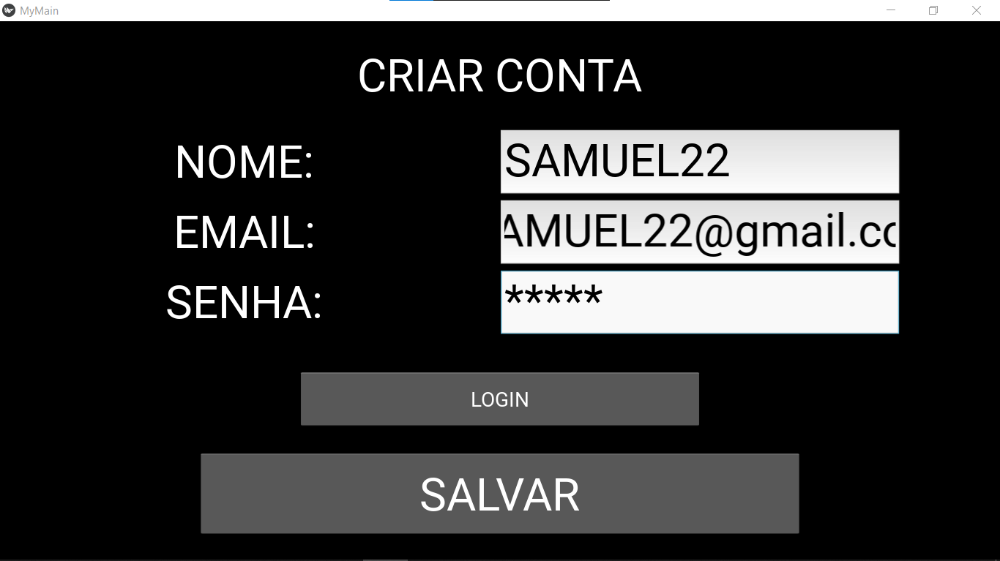
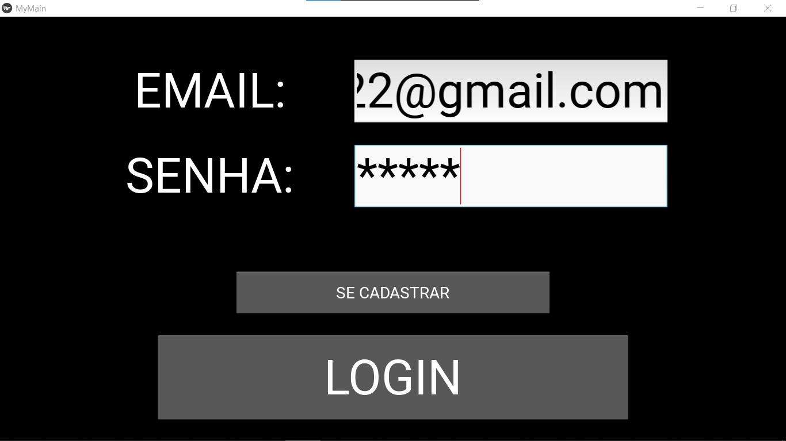
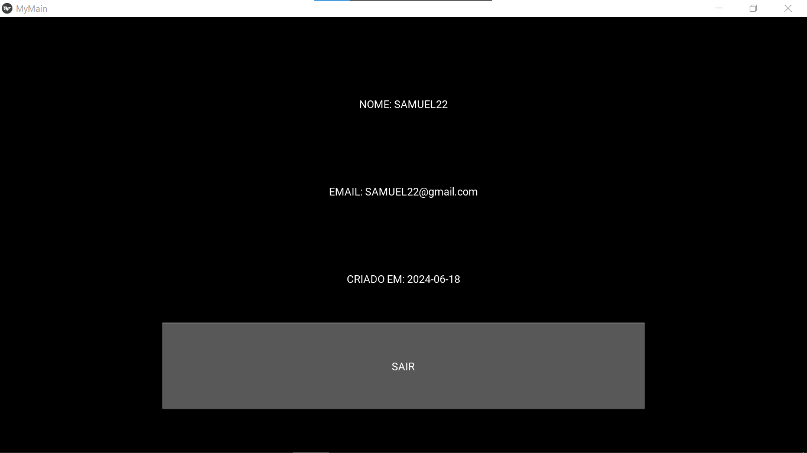
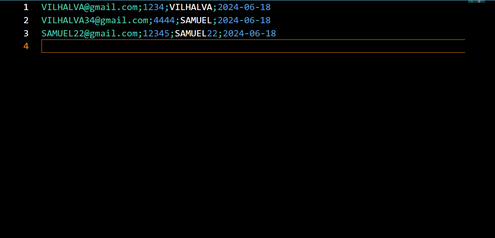

# LOGIN COM KIVY
👨‍🏫SE CADASTRE E FAÇA LOGIN COM KIVY E TXT.

 <br>
 <br>
 <br>
 <br>

## DESCRIÇÃO:
- Esse projeto é uma aplicação básica de autenticação usando Kivy, onde os usuários podem criar contas, fazer login e visualizar informações básicas de perfil.

- Este projeto é um exemplo simples de como criar uma aplicação básica de autenticação usando Kivy, com funcionalidades de criar conta, login e exibir informações de perfil.

## FUNCIONALIDADES:
1. **Criar Conta (`CreateAccountWindow`)**:
   - Os usuários podem inserir um nome, email e senha para criar uma nova conta.
   - A validação é feita para garantir que todos os campos sejam preenchidos corretamente antes de permitir o registro.
   - Após o registro bem-sucedido, os dados do usuário são armazenados em um arquivo texto (`users.txt`).

2. **Login (`LoginWindow`)**:
   - Os usuários podem inserir seu email e senha para fazer login na aplicação.
   - É feita uma validação contra os dados armazenados no arquivo `users.txt`.
   - Se as credenciais estiverem corretas, o usuário é redirecionado para a tela principal (`MainWindow`).

3. **Tela Principal (`MainWindow`)**:
   - Após o login bem-sucedido, esta tela exibe o nome do usuário, email e a data de criação da conta.
   - Há um botão para sair da conta, redirecionando de volta para a tela de login.

4. **Pop-ups de Mensagem (`invalidLogin` e `invalidForm`)**:
   - Pop-ups são exibidos em caso de login inválido ou se um formulário de criação de conta é enviado com dados incorretos ou faltantes.

## EXECUTANDO O PROJETO:
1. **Instale as Dependências**:
   - Vá até `./CODIGO` e digite o seguinte comando no Terminal/CMD:
   ```sh
   pip install -r requirements.txt
   ```

2. **Execute o Script Principal**:

   ```sh
   python main.py
   ```

3. **Criar Conta**:
   - Na tela de login (`LoginWindow`), clique no botão "Se Cadastrar".
   - Isso o levará para a tela de criação de conta (`CreateAccountWindow`).
   - Preencha todos os campos corretamente (nome, email e senha) e clique em "Salvar".
   - Se bem-sucedido, você será redirecionado de volta para a tela de login.

4. **Login**:
   - Na tela de login (`LoginWindow`), insira o email e senha cadastrados.
   - Clique em "Login".
   - Se as credenciais estiverem corretas, você será redirecionado para a tela principal (`MainWindow`).

5. **Tela Principal**:
   - Após o login bem-sucedido, na tela `MainWindow`, você verá seu nome, email e a data de criação da conta.
   - Clique em "Sair" para fazer logout e voltar para a tela de login.

6. **Mensagens de Erro**:
   - Caso haja erros durante o processo de login ou criação de conta (como campos vazios, email inválido, senha incorreta, etc.), pop-ups informativos serão exibidos.

## NÃO SABE?
- Entendemos que para manipular arquivos em muitas linguagens, é necessário possuir conhecimento nessas áreas. Para auxiliar nesse aprendizado, oferecemos cursos gratuitos disponíveis:
* [CURSO DE PYTHON](https://github.com/VILHALVA/CURSO-DE-PYTHON)
* [CURSO DE KIVY](https://github.com/VILHALVA/CURSO-DE-KIVY)
* [CONFIRA MAIS CURSOS](https://github.com/VILHALVA?tab=repositories&q=+topic:CURSO)

## CREDITOS:
- [PROJETO CRIADO PELO "techwithtim"](https://github.com/techwithtim/Kivy-GUI-Example)
- [PROJETO FEITO PELO VILHALVA](https://github.com/VILHALVA)


